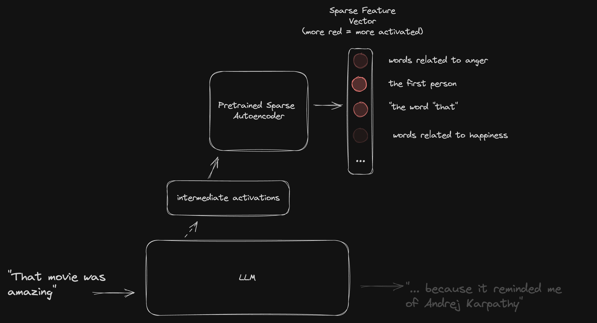

# LLM Sparse Autoencoder Embeddings can be used to train NLP classifiers

Below is some data which seems to show a small classifier trained on a sparse auto-encoding derived from GPT2-small (à la [golden gate claude](https://www.anthropic.com/news/golden-gate-claude)) out-performing various other straightforward methods for getting GPT2 to act as a classifier on the [IMDB Sentiment dataset](https://paperswithcode.com/sota/sentiment-analysis-on-imdb).

The upshot is that training autoencoders (sparse or otherwise) on LLMs may be a good way to get them to perform well on classification tasks. 

## Wait, aren't LLMs good classifiers already?

Not really.

Large Langauge Models like LLama, GPT-4 etc. seem to be able to parse and understand plaintext to a a near human level degree of sophistiaction, but in practice actually getting encoder-only LLMs to act as classifiers turns out to be a pain in the ass. 

We could try to go into why, but the bottom line is that essentially all mature classification benchmarks in NLP outside of the few-shot domain (e.g. [IMBD Sentiment](https://paperswithcode.com/sota/sentiment-analysis-on-imdb)) are still topped by comparatively tiny and quaint [BERT-variants](https://huggingface.co/blog/bert-101). 

This sucks because in practice most real-world NLP tasks that people and companies actually need to done in the real world eventually boil down to some form of classifiaction, or possibly regression if things are really spicy. It's a shame that we don't have a good way of leveraging the immense power LLMs to help with these kinds of problems.

## So Sparse Autoencoders are the solution?

They might be? This is what a sparse autoencoder looks like:



You train it by having it observe the intermediate activations that flow through a LLM as the LLM processes different sequences. Eventually the autoencover starts to be able to pull out human-interpratable "features" which actvate only in response to certain words or phrases being processed by the host LLM, features like "words relating to mechanical devices", or "landmarks" or "the golden gate bridge". It's highly fascinating. A really good high level explanation by the some of the pioneers is [here](https://www.anthropic.com/news/golden-gate-claude), technical details can be found [here](https://transformer-circuits.pub/2024/scaling-monosemanticity/index.html) and there are even some nice explainer youtube videos like [this](https://www.youtube.com/watch?v=Mhp8vpOksWw).

Ok, so now we know roughly what a sparse autoencoder is, the really dumb and obvious idea is to just take those interpratable features, plonk them into classifier (xgboost, logistic regression, `torch.nn.Linear`, whatever) and train that classifier to perform some classification task in the usual way. 


This is essentially what I did, you can see the full results on this Weights and Biases page <------------ but long story short: I used different techniques to turn GPT2 models into classifiers and tested them on the IMBD sentiment analyssi benchmark. The technique which worked by far the best was sparse autoencoder features (in particular, the features from the `gpt2-small-res-jb.blocks.8.hook_resid_pre` autoencoder [sae_lens](https://github.com/jbloomAus/SAELens))

## Ok, so what?

Unfortunately using sparse autoencoder features doesn't really have any practical applications at this stage because all the CHONKY LLMs don't have high quality sparse autoencoders trained for them, and the results I'm getting with the small LLMS like gpt2-small are still a lot worse than BERT. The upshot is that when someone does build and release them (looking at you [Joseph Bloom](https://www.jbloomaus.com/)) we might finally kick BERT's ass.

## Hold, on, this is dumb, you're missing the whole point 

Of course the irony here is that people are training Sparse Autoencoders becasue they want to get a better idea of what is going on inside LLMs. Using those painstakingly accumulated features to then perform classification is a bit like using a delecate sculpture to try to batter down a door. In particular the whole point of making the features in the autoencoder **sparse** in the first place is to that they can be interpreted by humans. This almost certainly makes them *worse* for training classifiers on.

We could probably get much better classification results by training a regular, non-sparse autoencoder in a similar way. If anyone wants to work on that please get in touch.

## Ablation

Some other things I tried which did not work:

- You might expect this SAE feature classifiction strategy to perform well on few-shot tasks. To that end I created labeled versions of 3 of the datasets from the [RAFT benchmark](https://raft.elicit.org/) and tested the sae-classification strategy on these. The results were around what the RAFT authors achieved with an Adaboost classifier (with no LLM involvement), and n

 Performing classifiaction on few-shot benchmarks with gpt2 and the sparse autoncoder method.
- You might expect autoencoder features extracted from larger LLMs to better represent the underlying text, and therefore lead to better classifications. I tested this briefly by extracting sparse autoencoder features from mistral-7b using the `mistral-7b-res-wg.blocks.8.hook_resid_pre` autoencoder from [sae_lens](https://github.com/jbloomAus/SAELens). I found that this did not improve classification performance over the `gpt2-small-res-jb.blocks.8.hook_resid_pre` autoencoder.
- 

# Installation

## Mac/Linux

First Install python 3.10 and make sure you're using it.

Next get those pip dependencies

```
python -m venv v # or your favorite way to create a python virtual environment
source v/bin/activate
pip install -r requirements.txt
```

Run the (very, very sparse) tests

```
python -m pytest
```

You also need to create a credentials file called `.credentials.json` and put it in the root of the project structured exactly the same as `.credentials.example.json`. The only key you actually need is `HF_TOKEN` (a huggingface api token). The other keys are there to help keep track of my training files and run experiments on [runpod](runpod.io/console/gpu-cloud)

## Windows

god help you

# Usage

`cli.py` provides a command line interface for using the code. For more details try, but you should ignore everything except what pertains to the `train` and `params` commands.

```python cli.py --help```

The `train` command reads in a list of parameters and performs a training run for each paremeter set. You can see a list of 60 parameters in `experiments/60-classifiers.json`. The most basic usage is:

```python cli.py train experiments/60-classifiers.json```

By default all metrics will be logged to [Weights and Biases](https://wandb.ai). You can stop this with the `skip_wandb` parameter.

The `params` command is a utility option to make it easier to build large lists of parameter sets. It basically just executes the `app/build_params.py` script.

# Citations/References

The Sparse Autoencoder code comes from [sae_lens](https://github.com/jbloomAus/SAELens)

Most of the datasets come from the RAFT leaderboard: https://raft.elicit.org/

The other dataset is the IMDB dataset, which is cited as

```
@InProceedings{maas-EtAl:2011:ACL-HLT2011,
  author    = {Maas, Andrew L.  and  Daly, Raymond E.  and  Pham, Peter T.  and  Huang, Dan  and  Ng, Andrew Y.  and  Potts, Christopher},
  title     = {Learning Word Vectors for Sentiment Analysis},
  booktitle = {Proceedings of the 49th Annual Meeting of the Association for Computational Linguistics: Human Language Technologies},
  month     = {June},
  year      = {2011},
  address   = {Portland, Oregon, USA},
  publisher = {Association for Computational Linguistics},
  pages     = {142--150},
  url       = {http://www.aclweb.org/anthology/P11-1015}
}
```
